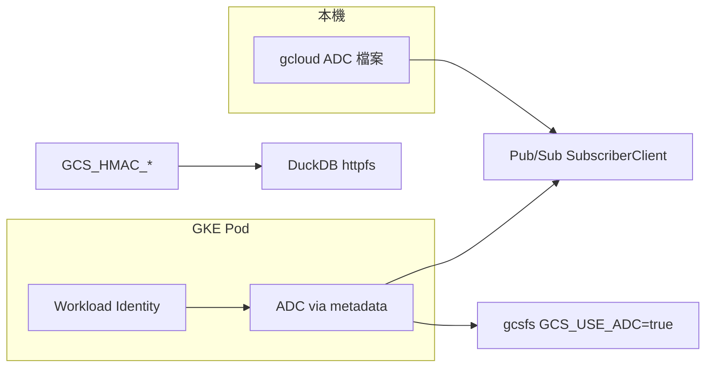

# stock-ana-task-worker

從雲端 queue 接收任務並執行的 worker。設定可寫在 `.env` 或系統環境變數（**環境變數優先於 `.env`**）。

```bash
cp .env.example .env
# 編輯 .env 後啟動
python main.py
# 或
python main.py --mode consumer
```

---

## 命令列參數

| 參數 | 必填 | 預設 | 說明 |
|---|---|:---:|---|
| `--mode` | 否 | `consumer` | 執行模式。目前僅 `consumer` 可用 |

也可用環境變數 `WORKER_MODE`（`--mode` 優先）。

| `--mode` 值 | 說明 |
|---|---|
| `consumer` | 啟動 queue worker（目前支援） |
| `oneshot` / `migrate` / `health` | 尚未實作 |

---

## 環境變數

### 必填（GCP worker）

| 變數 | 說明 |
|---|---|
| `GCP_PROJECT_ID` | GCP 專案 ID |
| `GCP_SUBSCRIPTION_ID` | Pub/Sub 訂閱名稱（此 Pod 監聽的 queue） |
| `OBJECT_STORAGE_BUCKET_BASE_PATH` | GCS 寫入路徑，格式 `bucket名稱/前綴` |
| `GCS_HMAC_ACCESS_KEY` | GCS HMAC 金鑰（DuckDB 讀寫 GCS 必填） |
| `GCS_HMAC_SECRET_KEY` | GCS HMAC 密鑰 |

### 建議設定

| 變數 | 預設 | 說明 |
|---|---|---|
| `CLOUD_PROVIDER` | `gcp` | 雲端廠商（目前僅支援 `gcp`） |
| `WORKER_TASK_TYPES` | `preprocessing` | 此 Pod 處理的任務類型，逗號分隔。合法值：`preprocessing`、`backtesting`、`full_backtest`、`buy_sell_mark`、`similarity` |
| `STORAGE_BACKEND` | `gcs` | 物件儲存後端；`CLOUD_PROVIDER=gcp` 時須為 `gcs` |
| `PG_HOST` | `localhost` | PostgreSQL 主機 |
| `PG_DATABASE` | `sexy_stock` | 資料庫名稱 |
| `PG_USER` | `postgres` | 資料庫使用者 |
| `PG_PASSWORD` | `password` | 資料庫密碼 |
| `PG_PORT` | `5432` | 資料庫埠 |

### 選填（調校用）

| 變數 | 預設 | 說明 |
|---|---|---|
| `WORKER_MODE` | `consumer` | 等同 `--mode`，CLI 未指定時使用 |
| `DUCKDB_POOL_SIZE` | `10` | DuckDB 連線池大小 |
| `PG_POOL_MIN_CONN` | `1` | PostgreSQL 連線池最小連線數 |
| `PG_POOL_MAX_CONN` | `10` | PostgreSQL 連線池最大連線數 |
| `PUBSUB_BATCH_SIZE` | `10` | 單次從 Pub/Sub 拉取的訊息數 |
| `PUBSUB_VISIBILITY_TIMEOUT` | `30` | 訊息 ack 期限（秒），逾時會重派 |
| `PUBSUB_PULL_TIMEOUT` | `5.0` | 無訊息時 pull 等待時間（秒） |
| `SHUTDOWN_DRAIN_TIMEOUT` | `30.0` | 關閉時等待進行中任務完成的秒數 |
| `GCS_USE_ADC` | `false` | `true` 時 fsspec/gcsfs 使用 GCP 預設憑證（DuckDB 仍須 HMAC） |

---

## 快速範例（`.env`）

```env
WORKER_MODE=consumer
CLOUD_PROVIDER=gcp
WORKER_TASK_TYPES=preprocessing

GCP_PROJECT_ID=my-project
GCP_SUBSCRIPTION_ID=preprocess-sub

STORAGE_BACKEND=gcs
OBJECT_STORAGE_BUCKET_BASE_PATH=my-bucket/data
GCS_HMAC_ACCESS_KEY=your-access-key
GCS_HMAC_SECRET_KEY=your-secret-key

PG_HOST=localhost
PG_DATABASE=sexy_stock
PG_USER=postgres
PG_PASSWORD=your-password
PG_PORT=5432
```

---

## GKE 部署與 GCP 權限

### `gcp_consumer.py` 需要改嗎？

**不需要。** 目前這行：

```python
self.subscriber = pubsub_v1.SubscriberClient()
```

會自動走 Google 的 **Application Default Credentials（ADC）** 憑證鏈，這是官方建議寫法。

| 環境 | ADC 來源 | 你要做的事 |
|---|---|---|
| 本機開發 | `gcloud auth application-default login` 產生的憑證檔 | 登入一次即可 |
| GKE | **Workload Identity**（Pod 透過 metadata 取得 GSA 身分） | 綁定 K8s SA ↔ GCP SA，**不要**掛 JSON 金鑰 |

本機與 GKE 都是「ADC」，差別只在憑證**從哪裡來**，程式碼不用分兩套。

> 不建議在 GKE 設定 `GOOGLE_APPLICATION_CREDENTIALS` 掛 service account JSON 檔（金鑰外洩風險、輪替麻煩）。請用 Workload Identity。

### GKE 建議權限設定

**1. 建立 GCP Service Account（GSA）**

例如 `stock-ana-task-worker@<PROJECT_ID>.iam.gserviceaccount.com`，授予：

| 用途 | IAM 角色（可再縮小範圍） |
|---|---|
| Pub/Sub 拉取 / ack | `roles/pubsub.subscriber` |
| GCS 讀寫（fsspec，`GCS_USE_ADC=true` 時） | `roles/storage.objectAdmin` 或自訂更細權限 |

**2. 啟用 GKE Workload Identity 並綁定**

```bash
# K8s ServiceAccount 綁定 GSA
gcloud iam service-accounts add-iam-policy-binding \
  stock-ana-task-worker@<PROJECT_ID>.iam.gserviceaccount.com \
  --role roles/iam.workloadIdentityUser \
  --member "serviceAccount:<PROJECT_ID>.svc.id.goog[<NAMESPACE>/<KSA_NAME>]"
```

Deployment 指定：

```yaml
spec:
  template:
    spec:
      serviceAccountName: stock-ana-task-worker   # K8s SA（含 workload identity 註解）
```

K8s ServiceAccount 註解範例：

```yaml
metadata:
  annotations:
    iam.gke.io/gcp-service-account: stock-ana-task-worker@<PROJECT_ID>.iam.gserviceaccount.com
```

**3. GKE 環境變數建議**

| 變數 | GKE 建議 |
|---|---|
| `GCS_USE_ADC` | `true`（gcsfs 走 GSA IAM，免 HMAC 給 fsspec） |
| `GCS_HMAC_*` | **仍需要**（DuckDB httpfs 目前走 HMAC，與 Pub/Sub 憑證無關） |
| `GOOGLE_APPLICATION_CREDENTIALS` | **不要設**（Workload Identity 自動處理） |

### 憑證與模組對照



---

## 延伸說明

組裝與變數對應細節見 [docs/worker_config_assembly.md](docs/worker_config_assembly.md)。
