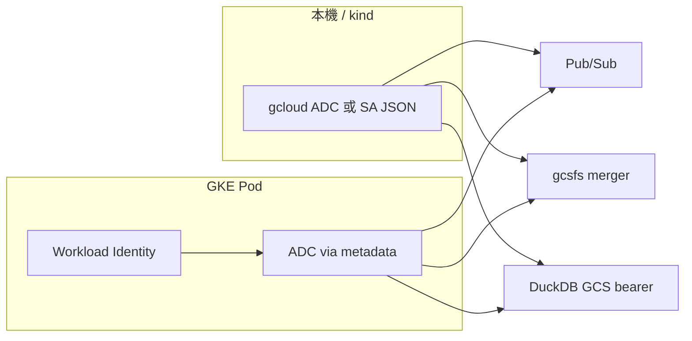

# stock-ana-task-worker

從雲端 queue 接收任務並執行的 worker。設定可寫在 `.env` 或系統環境變數（**環境變數優先於 `.env`**）。

```bash
cp .env.example .env
# 編輯 .env 後啟動
python main.py
# 或
python main.py --mode consumer
```

---

## 命令列參數

| 參數 | 必填 | 預設 | 說明 |
|---|---|:---:|---|
| `--mode` | 否 | `consumer` | 執行模式。目前僅 `consumer` 可用 |

也可用環境變數 `WORKER_MODE`（`--mode` 優先）。

| `--mode` 值 | 說明 |
|---|---|
| `consumer` | 啟動 queue worker（目前支援） |
| `oneshot` / `migrate` / `health` | 尚未實作 |

---

## 環境變數

### 必填（GCP worker）

| 變數 | 說明 |
|---|---|
| `GCP_PROJECT_ID` | GCP 專案 ID |
| `GCP_TASK_SUBSCRIPTION_ID` | Pub/Sub 訂閱名稱（此 Pod 監聽的 queue） |
| `OBJECT_STORAGE_BUCKET_BASE_PATH` | GCS 路徑；若 bucket 在根目錄則填 `bucket名稱`，有前綴則 `bucket/前綴` |

### GCP 憑證（Pub/Sub、gcsfs merger、DuckDB GCS 共用）

| 變數 | 預設 | 說明 |
|---|---|---|
| `GCP_AUTH_MODE` | `adc` | `adc`：Workload Identity / gcloud ADC；`service_account_json`：SA JSON 金鑰檔 |
| `GCP_SA_KEY_FILE` | — | `service_account_json` 時 JSON 路徑（優先於下方變數） |
| `GOOGLE_APPLICATION_CREDENTIALS` | — | `service_account_json` 時 JSON 路徑（備用） |
| `GCP_PUBSUB_AUTH_MODE` | — | 已棄用別名，請改用 `GCP_AUTH_MODE` |

同一個 worker 通常對應 **一個 GCP Service Account**；本機 / kind 測試時一份 JSON 即可驅動 Pub/Sub、GCS merger、DuckDB 寫入。

### 建議設定

| 變數 | 預設 | 說明 |
|---|---|---|
| `CLOUD_PROVIDER` | `gcp` | 雲端廠商（目前僅支援 `gcp`） |
| `WORKER_TASK_TYPES` | `preprocessing` | 此 Pod 處理的任務類型，逗號分隔。合法值：`preprocessing`、`backtesting`、`full_backtest`、`buy_sell_mark`、`similarity` |
| `STORAGE_BACKEND` | `gcs` | 物件儲存後端；`CLOUD_PROVIDER=gcp` 時須為 `gcs` |
| `PG_HOST` | `localhost` | PostgreSQL 主機 |
| `PG_DATABASE` | `sexy_stock` | 資料庫名稱 |
| `PG_USER` | `postgres` | 資料庫使用者 |
| `PG_PASSWORD` | `password` | 資料庫密碼 |
| `PG_PORT` | `5432` | 資料庫埠 |

### 選填（調校用）

| 變數 | 預設 | 說明 |
|---|---|---|
| `WORKER_MODE` | `consumer` | 等同 `--mode`，CLI 未指定時使用 |
| `LOG_LEVEL` | `info` | 日誌等級，僅支援 `info`、`debug` |
| `DUCKDB_POOL_SIZE` | `10` | DuckDB 連線池大小 |
| `PG_POOL_MIN_CONN` | `1` | PostgreSQL 連線池最小連線數 |
| `PG_POOL_MAX_CONN` | `10` | PostgreSQL 連線池最大連線數 |
| `PUBSUB_BATCH_SIZE` | `10` | 單次從 Pub/Sub 拉取的訊息數 |
| `PUBSUB_VISIBILITY_TIMEOUT` | `30` | 訊息 ack 期限（秒），逾時會重派 |
| `PUBSUB_PULL_TIMEOUT` | `5.0` | 無訊息時 pull 等待時間（秒） |
| `SHUTDOWN_DRAIN_TIMEOUT` | `30.0` | 關閉時等待進行中任務完成的秒數 |

---

## 快速範例（`.env`）

### 本機開發（gcloud ADC）

```env
WORKER_MODE=consumer
CLOUD_PROVIDER=gcp
WORKER_TASK_TYPES=preprocessing
GCP_AUTH_MODE=adc

GCP_PROJECT_ID=my-project
GCP_TASK_SUBSCRIPTION_ID=preprocess-sub

STORAGE_BACKEND=gcs
OBJECT_STORAGE_BUCKET_BASE_PATH=my-bucket

PG_HOST=localhost
PG_DATABASE=sexy_stock
PG_USER=postgres
PG_PASSWORD=your-password
PG_PORT=5432
```

啟動前先執行：`gcloud auth application-default login`

### kind / 本機 K8s（SA JSON）

```env
GCP_AUTH_MODE=service_account_json
GCP_SA_KEY_FILE=/var/secrets/google/key.json
# 其餘變數同上
```

---

## GCP 憑證與 IAM 權限

Worker 的 **Pub/Sub、gcsfs（merger）、DuckDB GCS** 皆透過 `GCP_AUTH_MODE` 使用同一套 GCP 身分（ADC 或 SA JSON），**不再需要 HMAC 金鑰**。

### 建議：一個應用一個 Service Account

| 項目 | 建議 |
|---|---|
| GSA 名稱 | 例如 `stock-ana-task-worker@<PROJECT_ID>.iam.gserviceaccount.com` |
| 對應關係 | 1 個 worker deployment ↔ 1 個 GSA ↔ 1 組 IAM |
| 本機 / kind | 下載該 GSA 的 JSON 金鑰，掛進 Secret，設 `GCP_SA_KEY_FILE` |
| GKE 正式 | 使用 Workload Identity，**不要**掛 JSON 金鑰 |

### IAM 角色（授予上述 GSA）

可依最小權限縮小到特定 subscription / bucket：

| 用途 | IAM 角色 | 建議綁定層級 |
|---|---|---|
| Pub/Sub pull / ack | `roles/pubsub.subscriber` | Subscription（如 `task-preprocessing`） |
| GCS 讀寫（merger、parquet） | `roles/storage.objectAdmin` | Bucket（如 `sexy_stock_test`） |

範例（請替換專案、訂閱、bucket）：

```bash
GSA=stock-ana-task-worker@<PROJECT_ID>.iam.gserviceaccount.com

gcloud pubsub subscriptions add-iam-policy-binding task-preprocessing \
  --member="serviceAccount:${GSA}" \
  --role="roles/pubsub.subscriber"

gcloud storage buckets add-iam-policy-binding gs://sexy_stock_test \
  --member="serviceAccount:${GSA}" \
  --role="roles/storage.objectAdmin"
```

### 本機開發

| 模式 | 設定 | 說明 |
|---|---|---|
| ADC（建議） | `GCP_AUTH_MODE=adc` | 執行 `gcloud auth application-default login` |
| SA JSON | `GCP_AUTH_MODE=service_account_json` + `GCP_SA_KEY_FILE` | 與 GKE 使用同一 GSA 的 JSON 亦可 |

### GKE（Workload Identity）

**1. 建立 GSA 並授予上方 IAM 角色**

**2. 建立 K8s ServiceAccount 並綁定 GSA**

```yaml
apiVersion: v1
kind: ServiceAccount
metadata:
  name: stock-ana-task-worker
  namespace: sexy-stock
  annotations:
    iam.gke.io/gcp-service-account: stock-ana-task-worker@<PROJECT_ID>.iam.gserviceaccount.com
```

```bash
gcloud iam service-accounts add-iam-policy-binding \
  stock-ana-task-worker@<PROJECT_ID>.iam.gserviceaccount.com \
  --role roles/iam.workloadIdentityUser \
  --member "serviceAccount:<PROJECT_ID>.svc.id.goog[sexy-stock/stock-ana-task-worker]"
```

**3. Deployment**

```yaml
spec:
  template:
    spec:
      serviceAccountName: stock-ana-task-worker
      containers:
        - env:
            - name: GCP_AUTH_MODE
              value: "adc"
            # 不要設 GOOGLE_APPLICATION_CREDENTIALS
```

### 憑證與模組對照



> GKE 上請勿掛載 GSA JSON 檔；kind 因無 Workload Identity，使用 `service_account_json` + Secret 為正常做法。

---

## 延伸說明

組裝與變數對應細節見 [docs/worker_config_assembly.md](docs/worker_config_assembly.md)。
