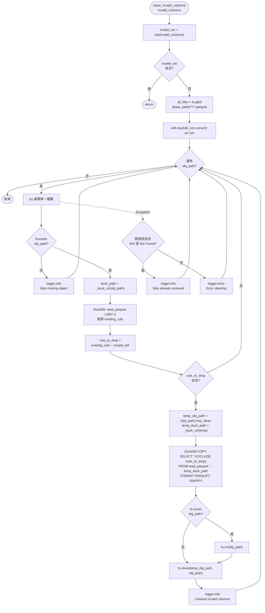

# BlobParquetDataHelper 流程圖

`infra/repo/data_helper/blob_parquet_helper.py` 中 `BlobParquetDataHelper` 各方法的流程說明與圖示。

## 類別概覽

| 方法 | 說明 | 流程圖 |
|------|------|--------|
| `clean_invalid_columns` | 批次移除 parquet 中指定的無效欄位 | [見下方](#clean_invalid_columns) |
| `rename_columns` | 批次重新命名 parquet 欄位 | 待補 |

### 依賴元件

- **fsspec (`self.fs`)**：列舉、檢查存在、刪除、搬移物件儲存上的檔案
- **DuckDB (`self.duckdb_con`)**：讀取 parquet schema、執行 `COPY` 寫出新 parquet
- **`DuckDBStorageConfig`**：將物件路徑轉為 DuckDB 可用的 URI（如 `gs://`）

### 建立方式

```python
from infra.repo.object_storage import create_parquet_helper

helper = create_parquet_helper(bucket_base_path, storage_config)
```

---

## clean_invalid_columns

### 用途

遍歷 `base_path` 下所有 `.parquet` 檔案，若檔案 schema 中含有 `invalid_columns` 裡的欄位，則透過 DuckDB 讀取後排除這些欄位，寫入暫存檔再覆蓋原檔。

### 輸入 / 輸出

| 項目 | 說明 |
|------|------|
| 輸入 | `invalid_columns: List[str]` — 要移除的欄位名稱清單 |
| 輸出 | 無回傳值；符合條件的 parquet 會被原地更新 |
| 副作用 | 物件儲存上的 parquet 內容變更；過程中產生 `{path}.tmp_clean` 暫存檔 |

### 流程圖



### 單檔處理步驟（文字版）

1. **前置檢查**：`invalid_columns` 為空則直接返回。
2. **掃描檔案**：`fs.glob("{base_path}/**/*.parquet")` 取得所有 parquet 路徑。
3. **逐檔處理**（在 DuckDB cursor 內）：
   - 檔案不存在 → 記錄 log，跳過。
   - 以 `read_parquet(... LIMIT 0)` 讀取 schema，不載入資料列。
   - 計算 `cols_to_drop = 檔案欄位 ∩ invalid_columns`；若為空則跳過。
   - DuckDB 執行 `COPY (SELECT * EXCLUDE (...)) TO 暫存路徑`。
   - 刪除原檔 → `fs.move` 將暫存檔覆蓋為原路徑。
4. **錯誤處理**：404 / Not Found 視為已刪除而跳過；其餘錯誤記錄 error 後繼續下一檔。

### 注意事項

- 非執行緒安全；並行執行可能因暫存檔 `{path}.tmp_clean` 衝突而失敗。
- 單檔失敗不會中斷整批；會繼續處理後續檔案。
- 欄位移除透過 DuckDB 完成，需確保 `DuckDBManager` 已正確初始化且能讀寫對應物件儲存 URI。
