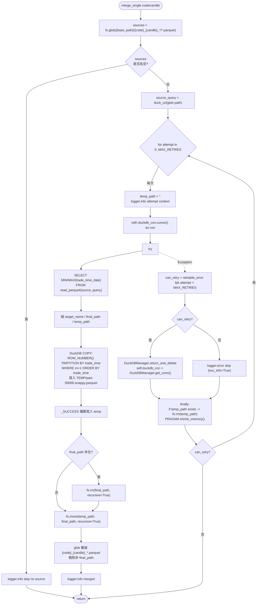

# BlobParquetMerger 流程圖

`infra/repo/data_meger/blob_parquet_meger.py` 中 `BlobParquetMerger` 各方法的流程說明與圖示。

> Schema 維護相關方法（`clean_invalid_columns`、`rename_columns`）已移至
> [`BlobParquetDataHelper`](blob_parquet_helper.md)。

## 類別概覽

| 方法 | 說明 | 流程圖 |
|------|------|--------|
| `merge_single` | 合併單一 code + candle 的多份 parquet | [見下方](#merge_single) |
| `batch_merge` | 依任務清單逐一呼叫 `merge_single` | 待補 |
| `merge_all_available_data` | 掃描並合併重複的 code + candle 資料集 | 待補 |

### 依賴元件

- **fsspec (`self.fs`)**：列舉、檢查存在、刪除、搬移物件儲存上的檔案
- **DuckDB (`self.duckdb_con`)**：讀取 parquet、執行 `COPY` 寫出合併結果
- **`DuckDBStorageConfig`**：將物件路徑轉為 DuckDB 可用的 URI（如 `gs://`）

### 建立方式

```python
from infra.repo.object_storage import create_parquet_merger

merger = create_parquet_merger(bucket_base_path, storage_config)
```

---

## merge_single

### 用途

將指定 `code` + `candle` 的多份 parquet（`{code}_{candle}_*/*.parquet`）做去重與排序後合併成單一資料集，並刪除舊檔。

### 輸入 / 輸出

| 項目 | 說明 |
|------|------|
| 輸入 | `code: str`, `candle: str` |
| 輸出 | 無回傳值（成功、無來源、失敗皆 `return`） |
| 副作用 | 產生/搬移 `TEMP_*.parquet` 暫存資料夾、刪除舊版本 parquet、可能重建 DuckDB 連線 |

### 流程圖


