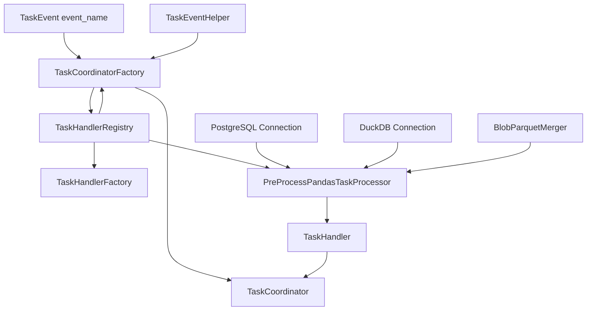
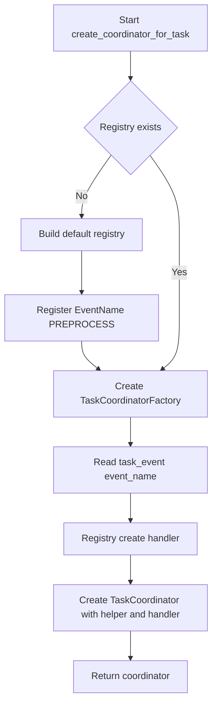

# Task Factory 元件圖與流程圖

此文件描述 `service/task/task_factory.py` 的核心元件關係與建立 `TaskCoordinator` 的流程。

## 元件圖（Component Diagram）

## 流程圖（Flow Diagram）

## 備註

- `TaskHandlerRegistry` 以 `event_name` 作為 key，不使用 `event_stage`。
- 目前預設僅註冊 `EventName.PREPROCESS`。
- 若有新任務（例如 backtesting），可擴充新的 `register(EventName.X, factory)`。
