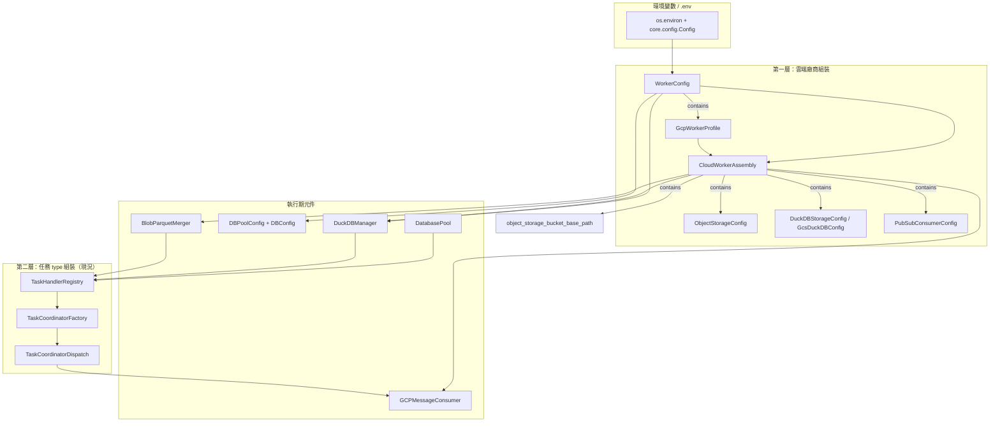
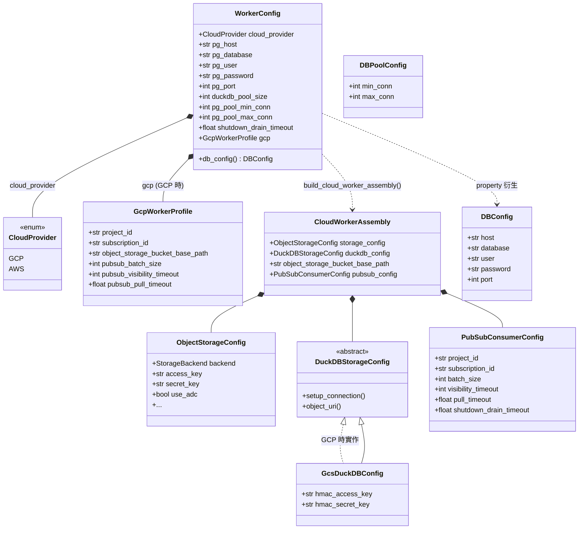
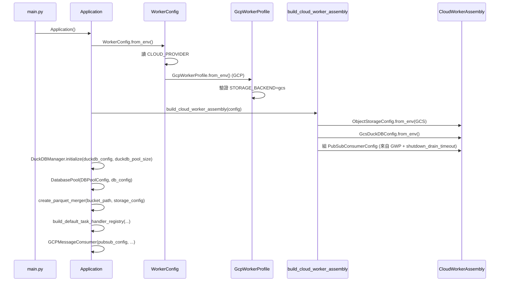
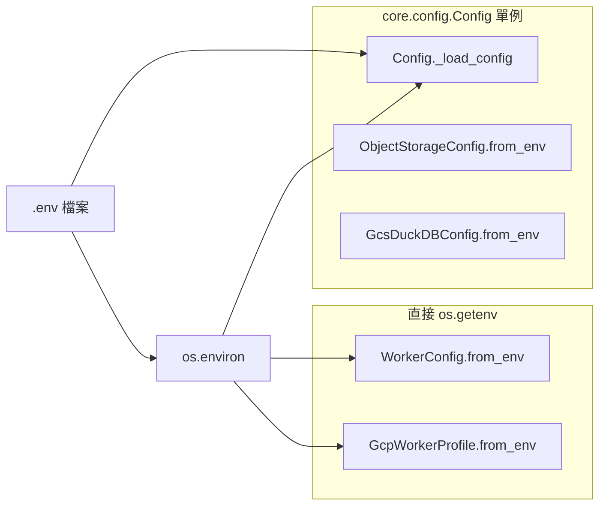

# Worker Config 組裝對應關係

此文件描述 worker 啟動時，各層 **Config 類別的包含關係**、**環境變數對應**，以及 **組裝後注入的執行期元件**。

目前僅實作 **GCP** 路徑（Pub/Sub + GCS）；AWS（SQS + S3）為後續擴充，文件中以虛線標示。

---

## 總覽：兩層組裝



---

## Config 類別包含關係（Class Diagram）



---

## 組裝流程（Bootstrap Sequence）



---

## 環境變數 → Config 對照表

### 根節點：`WorkerConfig`

| 環境變數 | Config 欄位 | 必填 | 預設值 | 說明 |
|---|---|:---:|---|---|
| `CLOUD_PROVIDER` | `cloud_provider` | 否 | `gcp` | 雲端廠商；`aws` 尚未實作 |
| `PG_HOST` | `pg_host` | 否 | `localhost` | PostgreSQL 主機 |
| `PG_DATABASE` | `pg_database` | 否 | `sexy_stock` | 資料庫名稱 |
| `PG_USER` | `pg_user` | 否 | `postgres` | 資料庫使用者 |
| `PG_PASSWORD` | `pg_password` | 否 | `password` | 資料庫密碼 |
| `PG_PORT` | `pg_port` | 否 | `5432` | 資料庫埠 |
| `DUCKDB_POOL_SIZE` | `duckdb_pool_size` | 否 | `10` | DuckDB 連線池大小 |
| `PG_POOL_MIN_CONN` | `pg_pool_min_conn` | 否 | `1` | PG 連線池最小連線數 |
| `PG_POOL_MAX_CONN` | `pg_pool_max_conn` | 否 | `10` | PG 連線池最大連線數 |
| `SHUTDOWN_DRAIN_TIMEOUT` | `shutdown_drain_timeout` | 否 | `30.0` | 關閉時等待進行中任務（秒） |

`WorkerConfig.db_config` 為 **衍生屬性**，由上述 `PG_*` 欄位組成 `DBConfig`，不單獨存於 `WorkerConfig` 內。

---

### 子節點：`GcpWorkerProfile`（`CLOUD_PROVIDER=gcp` 時由 `WorkerConfig.gcp` 承載）

| 環境變數 | Config 欄位 | 必填 | 預設值 | 說明 |
|---|---|:---:|---|---|
| `GCP_PROJECT_ID` | `project_id` | 是 | — | GCP 專案 ID |
| `GCP_SUBSCRIPTION_ID` | `subscription_id` | 是 | — | Pub/Sub Subscription |
| `OBJECT_STORAGE_BUCKET_BASE_PATH` | `object_storage_bucket_base_path` | 是 | — | GCS bucket/prefix 基底路徑 |
| `STORAGE_BACKEND` | （驗證用） | 否 | `gcs` | 必須為 `gcs`，否則拋錯 |
| `PUBSUB_BATCH_SIZE` | `pubsub_batch_size` | 否 | `10` | 單次 pull 最大訊息數 |
| `PUBSUB_VISIBILITY_TIMEOUT` | `pubsub_visibility_timeout` | 否 | `30` | Ack deadline（秒） |
| `PUBSUB_PULL_TIMEOUT` | `pubsub_pull_timeout` | 否 | `5.0` | 無訊息時 pull 等待（秒） |

---

### 第一層組裝產物：`CloudWorkerAssembly`

由 `build_cloud_worker_assembly(WorkerConfig)` 產生，包含下列四個成員：

#### 1. `ObjectStorageConfig`（fsspec / gcsfs 用）

來源：`ObjectStorageConfig.from_env(StorageBackend.GCS)`  
讀取方式：透過 `core.config.Config` 單例（`.env` + `os.environ`）

| 環境變數 | Config 欄位 | 必填 | 預設值 | 說明 |
|---|---|:---:|---|---|
| `GCS_HMAC_ACCESS_KEY` | `access_key` | 條件 | — | GCS S3-interop HMAC；`GCS_USE_ADC=false` 時建議設定 |
| `GCS_HMAC_SECRET_KEY` | `secret_key` | 條件 | — | 同上 |
| `GCS_USE_ADC` | `use_adc` | 否 | `false` | `true` 時 fsspec 走 ADC（`gcsfs`） |

> `backend` 固定為 `StorageBackend.GCS`（由 assembly 決定，不由 env 單獨切換）。

#### 2. `GcsDuckDBConfig`（DuckDB httpfs 用，與 `ObjectStorageConfig` 分離）

來源：`duckdb.factory.from_env(GCS)` → `GcsDuckDBConfig.from_env()`

| 環境變數 | Config 欄位 | 必填 | 說明 |
|---|---|:---:|---|
| `GCS_HMAC_ACCESS_KEY` | `hmac_access_key` | 是 | DuckDB `TYPE gcs` SECRET |
| `GCS_HMAC_SECRET_KEY` | `hmac_secret_key` | 是 | 同上 |

> DuckDB 路徑**目前不支援** `GCS_USE_ADC`，HMAC 金鑰為必要條件。

#### 3. `object_storage_bucket_base_path`（`str`）

來源：直接取自 `GcpWorkerProfile.object_storage_bucket_base_path`（`OBJECT_STORAGE_BUCKET_BASE_PATH`）。

#### 4. `PubSubConsumerConfig`

| 來源 Config | 對應欄位 |
|---|---|
| `GcpWorkerProfile.project_id` | `project_id` |
| `GcpWorkerProfile.subscription_id` | `subscription_id` |
| `GcpWorkerProfile.pubsub_batch_size` | `batch_size` |
| `GcpWorkerProfile.pubsub_visibility_timeout` | `visibility_timeout` |
| `GcpWorkerProfile.pubsub_pull_timeout` | `pull_timeout` |
| `WorkerConfig.shutdown_drain_timeout` | `shutdown_drain_timeout` |

---

### Application 內額外組裝的 Config（不屬於 `CloudWorkerAssembly`）

| Config 類別 | 來源 | 環境變數 |
|---|---|---|
| `DBPoolConfig` | `WorkerConfig.pg_pool_min_conn` / `pg_pool_max_conn` | `PG_POOL_MIN_CONN`, `PG_POOL_MAX_CONN` |
| `DBConfig` | `WorkerConfig.db_config` property | `PG_HOST`, `PG_DATABASE`, `PG_USER`, `PG_PASSWORD`, `PG_PORT` |
| DuckDBManager pool size | `WorkerConfig.duckdb_pool_size` | `DUCKDB_POOL_SIZE` |

---

## Config → 執行期元件對照

| 執行期元件 | 注入的 Config | 定義位置 |
|---|---|---|
| `DuckDBManager` | `duckdb_config` + `duckdb_pool_size` | `app/application.py` |
| `DatabasePool` | `DBPoolConfig` + `DBConfig` | `app/application.py` |
| `BlobParquetMerger` | `object_storage_bucket_base_path` + `storage_config` | `infra/repo/object_storage.py` |
| `GCPMessageConsumer` | `pubsub_config` | `app/application.py` |
| `TaskHandlerRegistry` | `pg_pool`, DuckDB conn, `parquet_merger` | `service/task/task_factory.py` |

第二層任務組裝（依 `event_name` 選 handler）目前**不引入額外 Config 類別**，僅使用第一層已組裝好的依賴。

---

## 環境變數讀取路徑差異

系統存在兩種 env 讀取方式，組裝時都會用到：



| 讀取方式 | 使用處 | 行為 |
|---|---|---|
| `os.getenv` | `WorkerConfig`, `GcpWorkerProfile` | 直接讀程序環境變數 |
| `Config()` 單例 | `ObjectStorageConfig`, `GcsDuckDBConfig` | 合併 `.env` 與 `os.environ`（**環境變數優先**） |

`GcpWorkerProfile.from_env()` 會呼叫 `Config()` 以確保 `.env` 已載入，但 profile 自身欄位仍透過 `os.getenv` 讀取。

---

## GCP 組裝樹狀結構（目前實作）

```
WorkerConfig                          ← WorkerConfig.from_env()
├── cloud_provider: gcp
├── pg_* / duckdb_pool_size / pg_pool_* / shutdown_drain_timeout
└── gcp: GcpWorkerProfile             ← GcpWorkerProfile.from_env()
    ├── project_id          ← GCP_PROJECT_ID
    ├── subscription_id     ← GCP_SUBSCRIPTION_ID
    ├── object_storage_bucket_base_path ← OBJECT_STORAGE_BUCKET_BASE_PATH
    └── pubsub_*            ← PUBSUB_*

        build_cloud_worker_assembly()
        └── CloudWorkerAssembly
            ├── storage_config: ObjectStorageConfig
            │   └── GCS_HMAC_* / GCS_USE_ADC
            ├── duckdb_config: GcsDuckDBConfig
            │   └── GCS_HMAC_ACCESS_KEY / GCS_HMAC_SECRET_KEY
            ├── object_storage_bucket_base_path  (來自 GcpWorkerProfile)
            └── pubsub_config: PubSubConsumerConfig
                ├── 來自 GcpWorkerProfile 的 pub/sub 欄位
                └── shutdown_drain_timeout  (來自 WorkerConfig)

Application._bootstrap() 額外組裝
├── DBPoolConfig(min_conn, max_conn)     ← WorkerConfig
├── DBConfig                             ← WorkerConfig.db_config
├── DuckDBManager(duckdb_config, pool_size)
├── BlobParquetMerger(path, storage_config)
├── TaskHandlerRegistry → TaskCoordinatorDispatch
└── GCPMessageConsumer(pubsub_config, coordinator, ...)
```

---

## 後續 AWS 擴充（尚未實作）

`CLOUD_PROVIDER=aws` 時預期結構（供對照，**目前會拋 `NotImplementedError`**）：

```
WorkerConfig
├── cloud_provider: aws
└── aws: AwsWorkerProfile          ← 待新增
    ├── sqs_queue_url
    ├── object_storage_bucket_base_path
    └── sqs_* 調校參數

CloudWorkerAssembly (AWS 版)
├── storage_config: ObjectStorageConfig (S3)
│   └── AWS_ACCESS_KEY_ID / AWS_SECRET_ACCESS_KEY / AWS_REGION
├── duckdb_config: (待實作 S3 DuckDB config)
├── object_storage_bucket_base_path
└── sqs_config: SqsConsumerConfig  ← 待新增
```

---

## 相關原始碼

| 檔案 | 職責 |
|---|---|
| `app/config.py` | `WorkerConfig` 根設定 |
| `app/cloud/gcp_profile.py` | GCP 專用 profile |
| `app/cloud/assembly.py` | 第一層 `CloudWorkerAssembly` 組裝 |
| `app/cloud/provider.py` | `CloudProvider` enum |
| `app/application.py` | 完整 bootstrap / teardown |
| `infra/repo/object_storage.py` | `ObjectStorageConfig` |
| `infra/repo/duckdb/gcs_config.py` | `GcsDuckDBConfig` |
| `infra/repo/pg_dao.py` | `DBConfig`, `DBPoolConfig` |
| `service/consumer/gcp_consumer.py` | `PubSubConsumerConfig` |
| `.env.example` | 環境變數範本 |

## 延伸閱讀

- 任務 type 第二層組裝：[task_factory_component_and_flow.md](./task_factory_component_and_flow.md)
